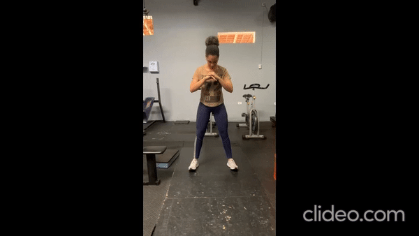

<h1 align="center">🚀Acompanhamento Fitness🚀</h1>
<p align="center">🏃‍♂️Sistema com contagem de execuções de exercícios e contagem de calorias gastas🏃‍♂️</p>


<p>🔥Agachamentos</p>



<p>🔥Polichinelos</p>


Tecnologia
============

Nosso sistema conta com o uso de uma ferramenta invoadora desenvovida pelo Google chamada "Pose landmark detection", pertencente da biblioteca Mediapipe. Essa ferramenta é capaz de traçar e pontuar partes do corpo humano permitindo com que os desenvolvedores consigam detectar gestos e movimentos.

Os Agachamentos🏋️‍♀️: Para identificarmos o exercício de agachamento foi preciso primeiramente entender como ele funciona, o principal desafio foi entender que cada pessoa tem um tamanho diferente e isso é crucial para calcular o quanto pode agachar, optamos por fazer com porcentagem e garantir que todas as alturas pudessem utilizar o sistema, sendo assim é contado como executado quando o quadril atinge uma proximidade de 40% com o joelho e quando volta para a posição inicial se permite uma nova execução. 🏋️‍♀️

Os Polichinelos💪: No caso dos polichinelos não foi diferente, primeiramente notamos como funciona o exercício e partimos para as comparações, entendemos que ao aproximar as mãos e separar os pés é formado a execução. Sendo assim ao detectar que houve uma proximidade determinada das mãos e separação dos pés se conta como uma execução e quando acontece ao contrário é liberado para uma nova execução. 💪

As Calorias 🔥: A cada execução de uma série de exercício são contadas as calorias gastas em média por cada execução e somadas a um contador na tela inicial do sistema, possibilitando ao usuário entender que além de se divertir com o sistema está emagrecendo. 🔥


Instalação
============

Para rodar o código do nosso sistema é necessário ter alguns pacotes instalados, sendo eles com seus respectivos códigos de instalação:

OpenCV
```bash
pip install opencv-python
```

Mediapipe
```bash
pip install mediapipe
```

PySimpleGUI
```bash
pip install pysimplegui
```
